# 🎓 Yaksha Internship FAQ & Support Portal

[](https://nextjs.org/)
[](https://www.mongodb.com/)
[](https://authjs.dev/)
[](https://tailwindcss.com/)
[](https://www.framer.com/motion/)

Welcome to **Yaksha FAQ & Support Portal** (also referred to as `yaksha-faq`), a production-ready, feature-rich web application built from scratch to streamline onboarding, support, and query resolution for candidates of the **Vicharanashala Internship (VINS)** at **IIT Ropar**.

The platform is designed to provide interns with self-service support via advanced interactive FAQ searches, an AI-inspired smart chatbot with instant replies, and structured support query workflows, all supported by a comprehensive, fully animated administrative control center.

---

## 🏗️ Architecture & Data Flow

Below is the conceptual architecture showing how client applications, API controllers, secure route guards, and database schemas integrate to provide a robust user experience:

```mermaid
graph TD
    classDef client fill:#2563EB,stroke:#1D4ED8,stroke-width:2px,color:#FFF;
    classDef server fill:#7C3AED,stroke:#6D28D9,stroke-width:2px,color:#FFF;
    classDef db fill:#10B981,stroke:#047857,stroke-width:2px,color:#FFF;
    classDef guard fill:#EF4444,stroke:#B91C1C,stroke-width:2px,color:#FFF;

    subgraph Client ["Client Side (React 19 & Framer Motion)"]
        Landing["🏠 Home / Portal Entry"]
        FaqView["🔍 FAQ Search & Category Filter"]
        UserDash["📊 User Dashboard (Protected)"]
        ChatBot["💬 Yaksha Mini Floating Chatbot"]
        AdminDash["🛠️ Admin Dashboard & Recharts Analytics"]
        Submitter["📝 Support Query / FAQ Suggestion Forms"]
    end

    subgraph Server ["Server Side (Next.js 15 App Router)"]
        Middleware["🛡️ NextAuth v5 Middleware (RBAC Guard)"]
        API_Auth["🔑 /api/auth/* (Credentials Provider)"]
        API_Chat["🤖 /api/chat (MongoDB $text Match & History)"]
        API_FAQs["📚 /api/faqs/* (CRUD & Search Endpoint)"]
        API_Queries["✉️ /api/queries/* (Create & Reply Handler)"]
        API_Suggest["💡 /api/faq-suggestions/* (Moderate Suggestion)"]
        API_Stats["📈 /api/admin/stats (Aggregate Analytics)"]
    end

    subgraph DB ["Database Tier (MongoDB & Mongoose Schema)"]
        Coll_Users[("👤 Users Collection")]
        Coll_FAQs[("📚 FAQs Collection ($text Index)")]
        Coll_Queries[("✉️ Queries Collection")]
        Coll_Suggestions[("💡 FAQ Suggestions Collection")]
        Coll_Chat[("💬 Chat History Collection")]
    end

    Landing --> FaqView
    Landing --> ChatBot
    UserDash --> Submitter
    UserDash --> ChatBot

    %% Middleware flow
    UserDash -.-> Middleware
    AdminDash -.-> Middleware
    Middleware --> API_FAQs
    Middleware --> API_Queries
    Middleware --> API_Suggest
    Middleware --> API_Stats

    %% Direct endpoints
    Submitter --> API_Queries
    Submitter --> API_Suggest
    ChatBot --> API_Chat
    Landing --> API_Auth

    %% API to DB
    API_Auth --> Coll_Users
    API_Chat --> Coll_FAQs
    API_Chat --> Coll_Chat
    API_FAQs --> Coll_FAQs
    API_Queries --> Coll_Queries
    API_Suggest --> Coll_Suggestions
    API_Stats --> Coll_Users
    API_Stats --> Coll_FAQs
    API_Stats --> Coll_Queries
    API_Stats --> Coll_Suggestions

    class Landing,FaqView,UserDash,ChatBot,AdminDash,Submitter client;
    class Middleware guard;
    class API_Auth,API_Chat,API_FAQs,API_Queries,API_Suggest,API_Stats server;
    class Coll_Users,Coll_FAQs,Coll_Queries,Coll_Suggestions,Coll_Chat db;
```



---

## ⚡ Core Features

### 1. Unified Authentication System (NextAuth.js v5)
- **Role-Based Access Control (RBAC)**: Separates platform functionality into `user` and `admin` portals.
- **Secure Credentials Auth**: Passwords are securely hashed using `bcryptjs` upon user registration.
- **Session Protection**: Protects specific directories (e.g., `/dashboard`, `/admin/*`) using Next.js Middleware.
- **Dual Login Views**: Seamlessly handles standard candidate login alongside dedicated administrator portals.

### 2. Rich Interactive FAQ Browser
- **Dynamic Search**: Instant responsive filtering with MongoDB fuzzy text matching.
- **Category Filter Pills**: High-fidelity clickable category pills corresponding to primary cohort topics (NOC, Certificates, Selection, Work & Mentorship, Rosetta Journal, etc.).
- **Smooth Animations**: Animated collapsible accordions built with `framer-motion` to offer a premium UI.

### 3. "Yaksha Mini" Intelligent Chatbot
- **Interactive Popup**: An animated floating chatbot located at the bottom-right corner.
- **Instant Search API**: Matches questions in real time using a MongoDB `$text` search on the FAQ database, returning the best response and linking relevant items.
- **Action Fallbacks**: Guides users when no matches are found by offering shortcut buttons to suggest a new FAQ or submit a direct query.
- **Chat Histories**: Stores dialogues directly in `chatHistory` for session persistent retention.

### 4. Support Queries & Suggestion Workflows
- **Raise Queries**: Dedicated portal to submit formal query cases complete with categorization and priority levels (`Low`, `Medium`, `High`).
- **Query Tracking**: Instantly monitor status, timestamps, and administrator replies in real-time.
- **FAQ Suggestions**: Empower cohort members to suggest fresh FAQs, automatically routing submissions to the moderation panel.

### 5. Multi-dimensional Admin Dashboard
- **Recharts Analytics**: Interactive and responsive visual charts (Pie, Bar) outlining FAQ categories, query frequencies, and status distributions.
- **CRUD Operations**: Edit, add, or delete live FAQs dynamically.
- **Moderation Panel**: Accept or reject community FAQ suggestions with notes, updating the FAQ collection automatically upon approval.
- **User and Support Management**: Complete users view with access revocation and intuitive reply modals to address pending support tickets.

---

## 🛠️ Tech Stack & Architecture

| Layer | Technology | Purpose |
| :--- | :--- | :--- |
| **Core Framework** | Next.js 15.1.0 (App Router) | High-performance React framework for server components and APIs. |
| **Database** | MongoDB & Mongoose 8.8.2 | Document database for storage with singleton connection patterns. |
| **Authentication** | NextAuth.js v5 (Beta 25) | Unified role-based JWT authentication and middleware guards. |
| **Styling** | Tailwind CSS v4.0.0 | Rapid utility-first styling for elegant, premium interfaces. |
| **Animations** | Framer Motion 11.11.17 | Fluid micro-interactions, page reveals, and chatbot popups. |
| **Visual Reports** | Recharts 2.13.3 | Multi-colored SVG charts for admin statistics. |
| **Icons** | Lucide React 0.460.0 | Clean, lightweight modern SVG icons. |

---

## 📂 Project Structure

```bash
f:\FAQ\
├── app/                      # Next.js App Router root
│   ├── (auth)/               # Auth routes (Login & Registration)
│   ├── admin/                # Admin views (Login & Dashboards)
│   ├── api/                  # Backend REST API Routes
│   │   ├── admin/stats/      # Aggregated metrics for Recharts
│   │   ├── auth/             # Custom signup API endpoints
│   │   ├── chat/             # Chatbot search and history logging
│   │   ├── faq-suggestions/  # User FAQ suggestions CRUD
│   │   ├── faqs/             # Main FAQ CRUD and Search API
│   │   ├── queries/          # User Support query submissions
│   │   └── users/            # Administrator user administration
│   ├── dashboard/            # Candidate home space (protected)
│   ├── faqs/                 # Interactive user FAQ directory
│   ├── query-status/         # Direct query lookup portal
│   ├── raise-query/          # Submit support queries form
│   ├── suggest-faq/          # Suggestion form interface
│   ├── globals.css           # Global CSS variables & Tailwind v4
│   ├── layout.tsx            # Main HTML structure & Root layout
│   └── page.tsx              # Beautiful Landing Page with CTA sections
├── components/               # Shareable UI elements (e.g. Chatbot, Navbar)
├── lib/                      # Core helpers
│   └── db.ts                 # MongoDB connection manager (Singleton Pattern)
├── models/                   # Mongoose Database Schemas
│   ├── ChatHistory.ts        # Conversational bot log schema
│   ├── Faq.ts                # Base FAQ Schema (question, answer, category)
│   ├── FaqSuggestion.ts      # FAQ recommendation schema
│   ├── Query.ts              # Ticket system database schema
│   └── User.ts               # Authenticated candidate credentials schema
├── public/                   # Static icons, vector graphics, and images
├── scripts/                  # Project seeding scripts
│   └── seedFaqs.ts           # Clears collections & imports seed FAQ payload
├── types/                    # Common Typescript interfaces
├── package.json              # App dependencies & script records
├── tsconfig.json             # Typescript configurations
└── next.config.ts            # Next.js app configurations
```

---

## 🚀 Setup & Execution Guide

### 📋 Prerequisites
Ensure the following tools are installed on your environment:
- **Node.js**: `v18.x` or higher (compatible with React 19)
- **MongoDB**: A running local MongoDB instance or a remote **MongoDB Atlas** database URI.

---

### Step 1: Clone and Dependencies Installation
Navigate to your repository and download node packages:
```bash
npm install
```

---

### Step 2: Configure Environment Variables
Create a `.env.local` file at the project root using the following template:

```env
# MongoDB Connection String (Replace with your database configuration)
MONGODB_URI=mongodb://localhost:27017/yaksha-faq

# NextAuth Configuration
NEXTAUTH_SECRET=your_super_secret_jwt_signature_key
NEXTAUTH_URL=http://localhost:3000
```

> [!NOTE]
> Make sure `NEXTAUTH_SECRET` is a long, randomly generated string in production environments. You can generate one via: `openssl rand -base64 32`.

---

### Step 3: Seed the Database
Seed Vicharanashala's official internship FAQ entries (12 categories, 40+ structured items) and configure MongoDB text indices by running the seeding script:

```bash
# Using tsx to execute the typescript seed script
npm run seed
```

This script will:
1. Connect securely to your MongoDB database using the singleton connection.
2. Flush any old FAQ documents to prevent double seeds.
3. Import the rich FAQ data package.
4. Establish a `$text` search index on both the `question` and `answer` properties, enabling fast fuzzy search for the Yaksha Chatbot.

---

### Step 4: Run the Development Server
Launch the compiler and Next.js development server locally:

```bash
npm run dev
```

Open [http://localhost:3000](http://localhost:3000) in your favorite browser to test the platform.

---

### Step 5: Production Build and Start
To compile optimizations for live deployment, run the production build:

```bash
# Build the optimized production output
npm run build

# Start the built production server
npm run start
```

---

## 👤 Database Schemas

### Users (`users`)
```typescript
{
  name: string;
  email: string;
  password (hashed): string;
  role: 'user' | 'admin';
  createdAt: Date;
}
```

### FAQs (`faqs`)
```typescript
{
  question: string;
  answer: string;
  category: string; // "NOC", "Timing and Dates", "Work & Mentorship", etc.
  createdAt: Date;
}
// Requires MongoDB $text index on question + answer
```

### Support Queries (`queries`)
```typescript
{
  userId?: ObjectId;
  name: string;
  email: string;
  category: string;
  subject: string;
  message: string;
  priority: 'Low' | 'Medium' | 'High';
  status: 'Pending' | 'In Progress' | 'Solved';
  adminReply?: string;
  createdAt: Date;
  updatedAt: Date;
}
```

### Chat Logs (`chatHistory`)
```typescript
{
  userId?: string; // Session ID or anonymous token
  messages: [
    {
      sender: 'user' | 'bot';
      text: string;
      timestamp: Date;
    }
  ]
}
```
### FAQ Suggestions (`faqSuggestions`)

```typescript
{
  userId?: ObjectId;
  question: string;
  suggestedAnswer: string;
  category: string;
  description?: string;
  status: 'Pending' | 'Approved' | 'Rejected';
  adminReview?: string;
  createdAt: Date;
}

```

---

## 🎨 UI & Design Principles

The UI has been tailored to reflect Vicharanashala's professional standards:
- **Clean Theme**: Pristine modern backdrop styling (`#FFFFFF` / `#F8FAFC`).
- **Harmonious Accents**: Professional Ocean Blue (`#2563EB`) as primary tone, beautifully accented with deep amethyst violet (`#7C3AED`).
- **Glassmorphism Panels**: Interactive containers utilize soft backdrop blur filters (`backdrop-blur-md`), semi-transparent borders (`border-white/20`), and subtle shadows (`shadow-lg`).
- **Premium Animations**: Integrated subtle slide-ins, spring-based hovers, and clean responsive micro-interactions using Framer Motion.
- **Inter Font**: Streamlined global typography using Google's Inter sans-serif typeface.

---

## 🛡️ License & Attributions
- Created for **Vicharanashala Research Lab** (IIT Ropar).
- Intern FAQ guidelines and data compiled from the official [Vicharanashala Portal](https://samagama.in/internship/faq).
